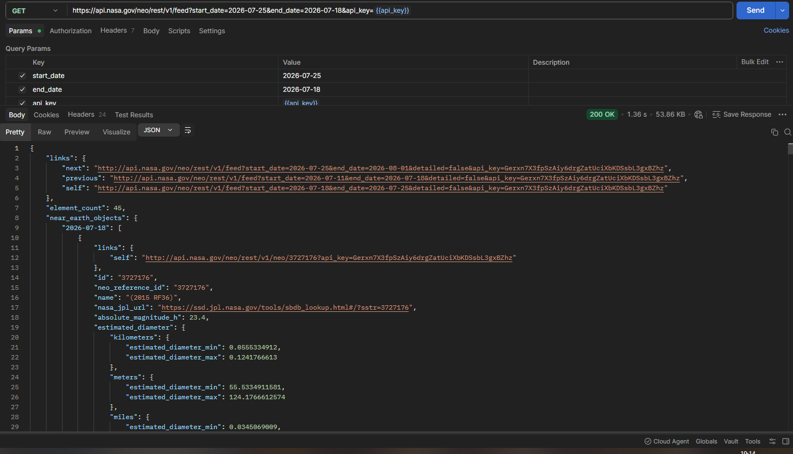

> 📁 Данный раздел посвящен комплексному тестированию REST API NASA NeoWs (Near Earth Object Web Service), предоставляющего данные об астероидах, сближающихся с Землей. Тестирование реализовано в инструменте **Postman**. В рамках этапа спроектированы позитивные и негативные сценарии, проведена валидация структуры JSON-ответов и выполнен глубокий исследовательский анализ неочевидного поведения бэкенда.

---

## ☄️ ЭНДПОИНТ 1: `GET /neo/rest/v1/feed` (Получение ленты астероидов за период)

### ✅ Позитивные проверки
* ✅ `API-FEED-1` **`Smoke-test: отправка валидных параметров`** - Передача корректного интервала дат (< 7 дней) и рабочего токена `api_key`. Ожидаемый ответ: `200 OK`.
* ✅ `API-FEED-2` **`Валидация структуры и схемы JSON-ответа`** - Проверка присутствия и типов обязательных корневых полей (`links`, `element_count`, `near_earth_objects`).
* ✅ `API-FEED-3` **`Проверка корректности группировки данных по датам`** - При запросе за 3 дня внутри объекта `near_earth_objects` генерируются строго 3 изолированных ключа-даты. Данные не смешиваются.
* ✅ `API-FEED-4` **`Соответствие интегрального счетчика объектов`** - Проверка соответствия числового значения в поле `element_count` фактическому суммарному количеству астероидов в массивах.
* ✅ `API-FEED-5` **`Запрос с дефолтными значениями (без указания периода)`** - Отправка запроса только с `api_key` (без `start_date`/`end_date`). Сервер корректно возвращает данные по умолчанию за текущие сутки.
* ✅ `API-FEED-6` **`Тест на пустой результат за архивный период`** - Выбор диапазона дат в глубоком прошлом, где активность отсутствует. Возвращается ответ `200 OK`, поле `element_count` равно `0`, массивы пустые.

### ❌ Негативные проверки
* ✅ `API-FEED-7` **`Превышение установленного лимита диапазона дат (> 7 дней)`** - Запрос интервала в 8 суток. Сервер успешно блокирует транзакцию, возвращая статус-код `400 Bad Request`.
* ✅ `API-FEED-8` **`Передача дат в невалидном формате`** - Использование формата `DD-MM-YYYY` вместо требуемого `YYYY-MM-DD`. Сервер блокирует запрос со статусом `400 Bad Request`.
* ✅ `API-FEED-9` **`Тест на авторизацию: отправка запроса без ключа`** - Попытка вызвать эндпоинт без параметра `api_key`. Доступ блокируется со статусом `401 Unauthorized`.
* ✅ `API-FEED-10` **`Тест на авторизацию: использование скомпрометированного токена`** - Передача измененного/несуществующего ключа. Доступ блокируется со статусом `401 Unauthorized`.

### 🔍 Проверки, требующие уточнения требований
* ❓ `API-FEED-11` **`Нарушение логической последовательности дат (start_date > end_date)`** - Передача даты начала позже, чем даты конца. Бэкенд автоматически переворачивает даты и возвращает `200 OK` вместо ошибки валидации `400 Bad Request`.

---

### 🧐 QA Insights

При проектировании негативных сценариев был выполнен тест на **нарушение логической последовательности дат**:
* **Параметры запроса:** `start_date` выставлен позже, чем `end_date` (период наоборот: с 25 июля по 18 июля).
* **Ожидаемое поведение:** Ошибка валидации параметров со статусом `400 Bad Request`.

**Фактическое поведение системы:**
Сервер проигнорировал ошибку логики, самостоятельно поменял даты местами во внутренней бизнес-логике и вернул успешный ответ со статусом `200 OK`. При этом в результирующем JSON структура объектов `near_earth_objects` автоматически выстроилась в правильном хронологическом порядке — начиная от меньшей даты (`2026-07-18`).

📸 Нажмите, чтобы посмотреть скриншот фиксации аномалии из Postman

> **📝 Заключение QA:** При отсутствии официальной спецификации данное поведение классифицируется как **требующее уточнения у системного аналитика / команды разработки**. Автоматическое исправление ошибок пользователя на стороне бэкенда без уведомления клиента может приводить к рассинхронизации данных на фронтенде.

---

## ➔ Навигация
* [🏠 Вернуться на Главную страницу всего портфолио](../../2.%20API%20NASA%20NeoWs%20-%20Тестирование%20API%20(Postman)/README.md)
* [🚀 Перейти к Чек-листу Эндпоинта 2: LOOKUP](../2.%20Эндпоинт%20Lookup%20(Поиск%20астероида)/README.md)
