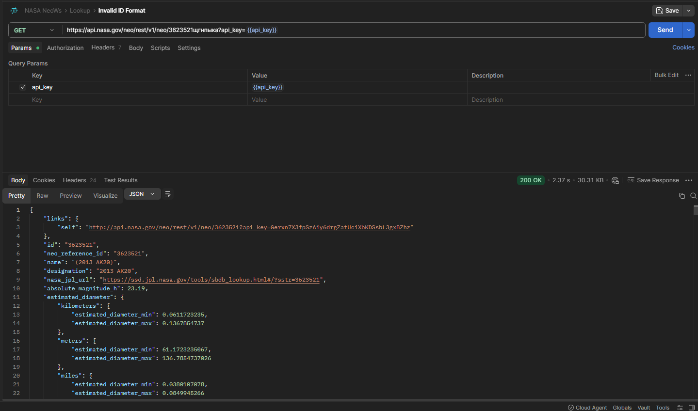

> 📁 Получение детального информационного досье конкретного околоземного астероида по его уникальному системному идентификатору (`asteroid_id`).

---

## 📋 Список проверок

### ✅ Позитивные проверки
* ✅ `API-LOOK-1` **`Smoke-тест: отправка валидного ID объекта`** - Запрос существующего ID астероида (например, `3542519`) при рабочем токене `api_key`. Ожидаемый ответ: `200 OK`.
* ✅ `API-LOOK-2` **`Валидация структуры и обязательных полей JSON`** - Проверка присутствия корневых объектов досье (`id`, `name`, `estimated_diameter`, `close_approach_data`).
* ✅ `API-LOOK-3` **`Валидация типов данных физических параметров`** - Проверка блока `estimated_diameter`. Минимальный и максимальный диаметры должны приходить строго в формате чисел (`float`/`int`) в 4 единицах измерения (км, м, мили, футы).
* ✅ `API-LOOK-4` **`Контроль строгого типа флага опасности объекта`** - Поле `is_potentially_hazardous_asteroid` должно иметь строго булевый тип данных (`true`/`false`) и не быть пустым.
* ✅ `API-LOOK-5` **`Анализ исторической ретроспективы сближений`** - Проверка массива `close_approach_data`. Верификация наличия истории прошлых подлетов объекта к Земле с указанием точной скорости и расстояния.

### ❌ Негативные проверки
* ✅ `API-LOOK-6` **`Запрос несуществующего числового идентификатора`** - Отправка выдуманного ID (например, `99999999999`). Сервер корректно блокирует запрос со статусом `404 Not Found`.
* ✅ `API-LOOK-7` **`Передача латинских букв вперемешку с ID в URL`** - Передача буквенно-цифрового ID (например, `3523521sdhjfgo`). Сервер возвращает ожидаемую ошибку `404 Not Found`.
* ✅ `API-LOOK-8` **`Отправка запроса с пустым полем идентификатора`** - Обращение к эндпоинту без указания ID (путь `/neo/`). Сервер возвращает статус ошибки валидации пути.
* ✅ `API-LOOK-9` **`Использование запрещенных спецсимволов в пути запроса`** - Попытка передать знаки `/` или `?` внутрь ID. Запрос успешно отсекается серверным роутингом.
* ✅ `API-LOOK-10` **`Тест на авторизацию: запрос досье без api_key`** - Попытка вызвать защищенный эндпоинт без токена. Доступ блокируется со статусом `401 Unauthorized`.

### 🔍 Проверки, требующие уточнения требований
* ❓ `API-LOOK-11` **`Передача символов кириллицы внутри числового ID в URL-пути`** - При отправке ID с русскими буквами бэкенд игнорирует ошибку формата, молча отрезает кириллический хвост и возвращает статус `200 OK` вместо ошибки валидации.

---

### 🧐 QA Insights: Анализ аномалии парсинга URL-строки при вводе кириллицы

При тестировании устойчивости бэкенда к невалидным типам данных в URL-пути (`asteroid_id`) было зафиксировано кардинально разное поведение системы в зависимости от используемой кодировки:

* **Сценарий А (Латиница):** Запрос вида `3523521sdhjfgo7asdf` обрабатывается системой корректно - сервер пытается найти данный ID целиком, не находит объект и возвращает стандартную ошибку `404 Not Found`.
* **Сценарий Б (Кириллица):** Запрос вида `3623521щгкпык` приводит к скрытому сбою логики бэкенда. Вместо отклонения некорректного формата строки, внутренний парсер сервера обрезает невалидные кириллические символы, оставляет только начальные цифры `3623521`, осуществляет по ним успешный поиск в БД и возвращает статус `200 OK` с чистым цифровым ID в теле ответа.

📸 Нажмите, чтобы посмотреть скриншот фиксации аномалии с кириллицей (Статус 200 OK)

> **📝 Заключение QA:** Данное поведение является **критическим архитектурным ворнингом (Encoding & Parsing defect)**. Отсутствие строгой валидации входящей строки на бэкенде и автоматическое «обрезание» символов кириллицы без уведомления клиента нарушает стандарты безопасности REST API и может приводить к непредсказуемому поведению UI-компонентов. Рекомендуется заведение дефекта.

---

## ➔ Навигация
* [⬅️ Вернуться на Обложку модуля API](./README.md)
* [🏠 На Главную страницу всего портфолио](../../README.md)
